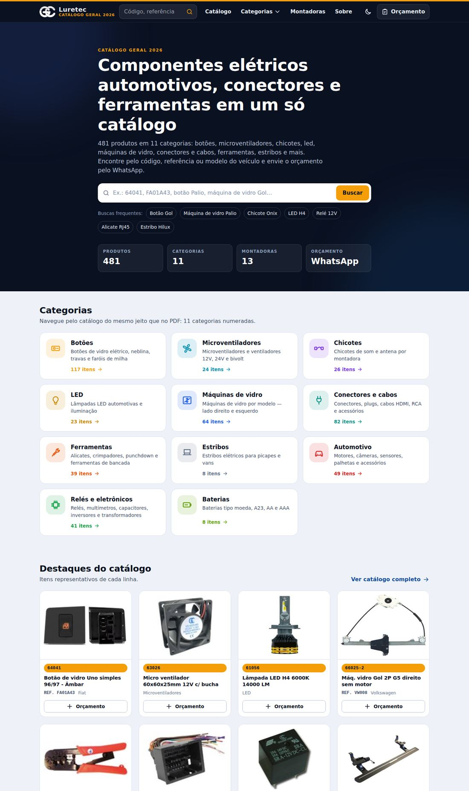
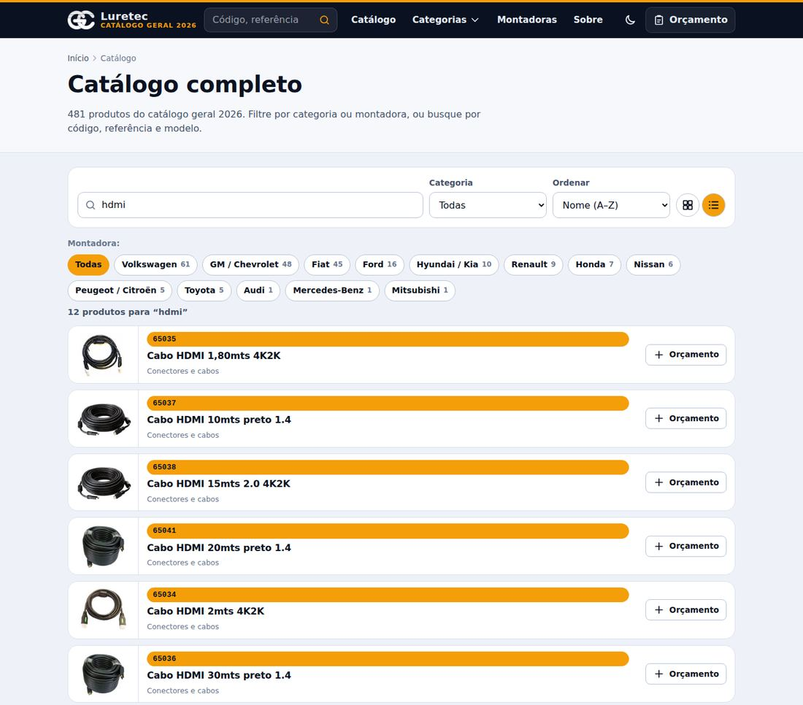
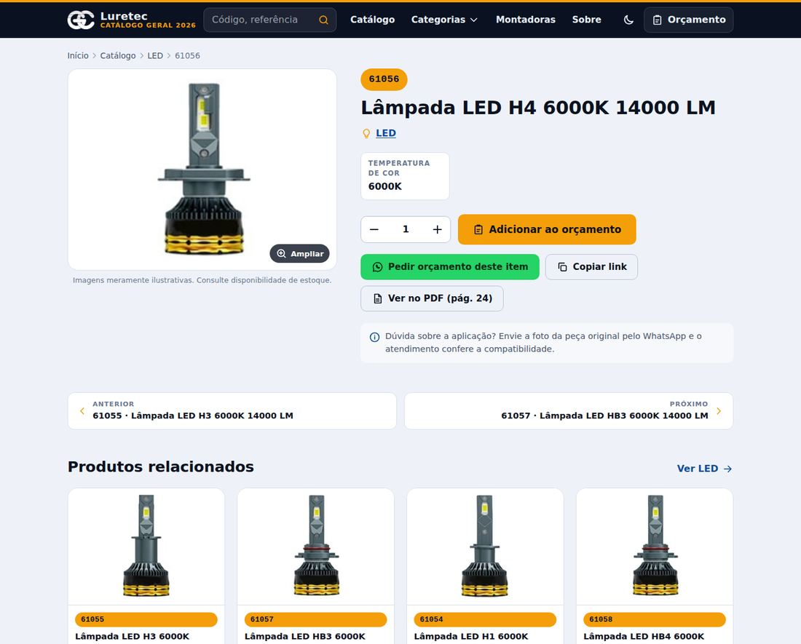
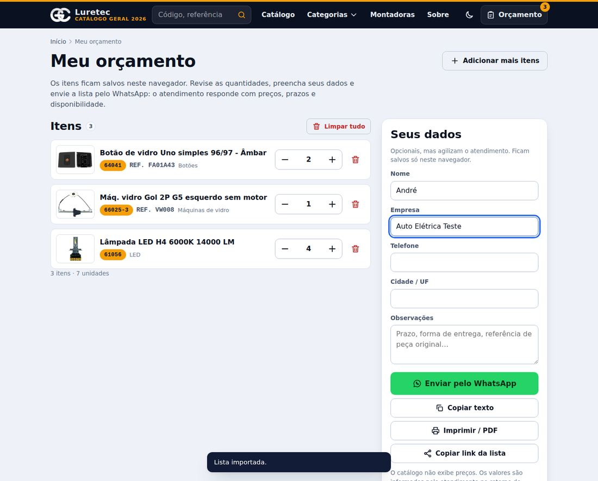
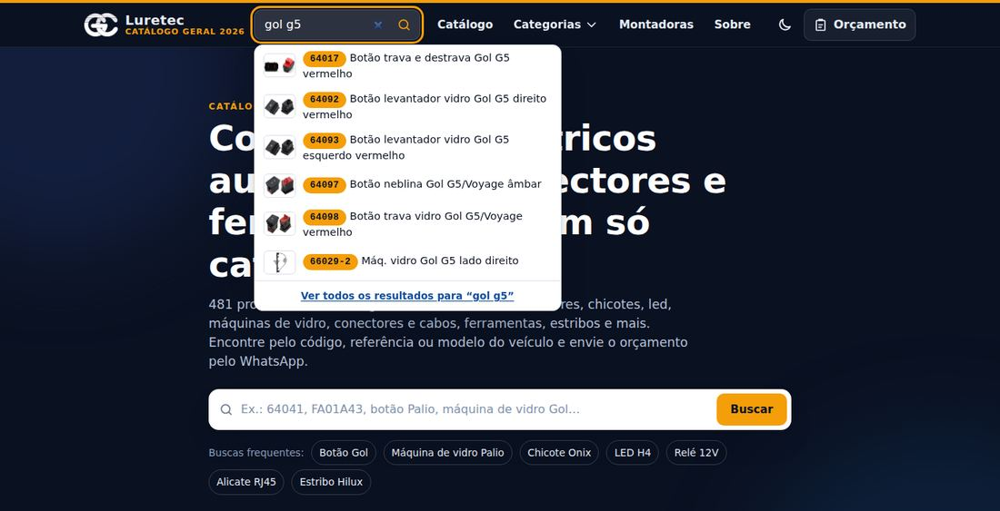
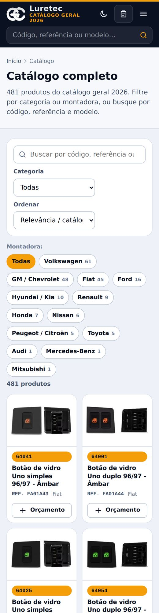
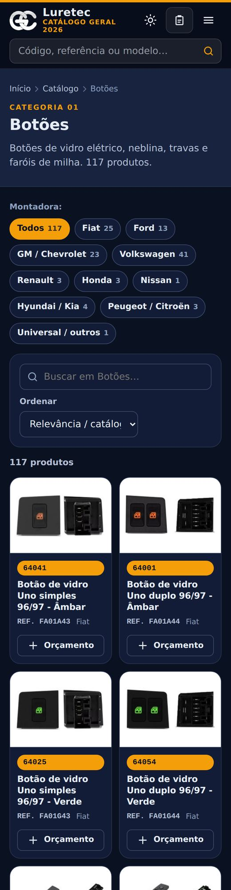

# Catálogo Luretec 2026 — site estático

Site completo do catálogo geral 2026 da Luretec, gerado a partir de `data/produtos.json`: **481 produtos em 11 categorias**, páginas por categoria, subgrupo e montadora, página para cada produto, busca instantânea, orçamento salvo no navegador e enviado pelo WhatsApp, PWA com funcionamento offline, SEO completo e dados abertos em JSON/CSV.

Sem dependências: Node 20+ e nada mais. Sem build de JavaScript, sem frameworks, sem CDN, sem fontes externas.

```
npm run build     # gera o site em dist/
npm run dev       # serve dist/ em http://localhost:4173 e reconstrói ao salvar
npm test          # testes (dados, busca, orçamento, build)
npm run validar   # confere data/*.json e fotos sem gerar o site
npm run importar -- --csv produtos.csv [--imagens fotos/]   # atualiza os produtos
```

## Como fica

| Início | Catálogo (modo lista) | Produto |
|---|---|---|
|  |  |  |

| Orçamento | Sugestões da busca | Mobile | Mobile, tema escuro |
|---|---|---|---|
|  |  |  |  |

## O que o site tem

| Área | Endereço | Conteúdo |
|---|---|---|
| Início | `/` | hero com busca, categorias, destaques, montadoras, como funciona |
| Catálogo | `/catalogo/` | os 481 produtos com busca, filtro por categoria/montadora, ordenação, grade ou lista |
| Categorias | `/categoria/<id>/` | 11 páginas; botões também por montadora (`/categoria/botoes/vw/`) |
| Montadoras | `/montadoras/`, `/montadora/<id>/` | peças agrupadas pelo veículo, com modelos citados |
| Produto | `/produto/<codigo>/` | foto com zoom, código, referência, aplicação, atributos, relacionados, anterior/próximo, link para a página do PDF |
| Orçamento | `/orcamento/` | itens com quantidade, dados do cliente, envio por WhatsApp, copiar, imprimir/PDF, link compartilhável |
| Sobre | `/sobre/` | apresentação, contato, categorias, dados abertos |
| API | `/api/produtos.json`, `/api/categorias.json`, `/api/montadoras.json`, `/api/produtos.csv` | dados públicos (sem preços) |
| PDF | `/downloads/catalogo-luretec-2026.pdf` | catálogo impresso |
| Sistema | `sitemap.xml`, `robots.txt`, `manifest.webmanifest`, `sw.js`, `404.html`, `offline.html` | SEO e PWA |

A busca aceita código (`64041`, `66025`), referência (`FA01A43`, `vw008`), nome, modelo do veículo, montadora e atributos (`gol esquerdo`, `12v 60x60`), sem diferenciar acentos. Links antigos continuam funcionando: `/orcamento/?p=64041` adiciona o item; `/?p=64041` abre o produto; `/catalogo/?c=maq` aceita os aliases antigos das categorias.

O site **não exibe preços**, por decisão do catálogo original: o atendimento responde ao orçamento pelo WhatsApp.

## Estrutura

```
site.config.json        nome, WhatsApp, URLs, textos institucionais, destaques
data/produtos.json      481 produtos (código, ref, nome, categoria, subgrupo, foto, página do PDF)
data/categorias.json    11 categorias (ícone, cor, descrição, subgrupos, aliases antigos)
data/montadoras.json    dicionário modelo → montadora usado para marcar as peças
public/                 copiado como está para dist/: css, js, fotos, ícones, PDF, sw.js, _headers
  js/lib/               módulos isomórficos (Node + navegador): util, busca, orçamento, card
src/build.js            gerador; src/lib (dados, HTML, SEO); src/pages (uma função por tipo de página)
scripts/                dev.js, validar-dados.js, importar-catalogo.js, extrair-pdf.py
tests/                  node --test
deploy/                 Dockerfile, nginx.conf, docker-compose.yml
.github/workflows/      testes em todo push; publicação no GitHub Pages a partir de main
design-system/MASTER.md tokens e regras visuais
```

## Como atualizar os produtos

**Pelo CSV do painel (rotina).** Exporte o CSV do painel Luretec (colunas `codigo`, `nome`, `ref`, `categoria`, `subcategoria`; nomes flexíveis) e rode:

```
node scripts/importar-catalogo.js --csv exportacao.csv --imagens pasta-com-fotos/ --dry-run   # só mostra o que mudaria
node scripts/importar-catalogo.js --csv exportacao.csv --imagens pasta-com-fotos/
npm run validar && npm run build
```

Por padrão o importador faz *merge*: atualiza os existentes, acrescenta novos e preserva a ordem. `--substituir` troca a lista inteira pela do CSV. Fotos são procuradas como `<codigo>.jpg|.png` na pasta indicada; a coluna `ativo` com `0`/`não` remove o item.

**Por um novo PDF do catálogo.** `pip install pymupdf pillow` e `python3 scripts/extrair-pdf.py Catalogo_Luretec_2027.pdf`. O script lê cards, códigos, referências, grupos por montadora e fotos pela posição na página, e regrava `data/produtos.json`, as fotos e o PDF em `public/downloads/`.

**Edição manual.** `data/produtos.json` é legível; `npm run validar` acusa código duplicado, categoria inexistente, foto faltando etc. Novas montadoras ou modelos entram em `data/montadoras.json` (evite números que pareçam ano).

## Configuração e deploy

`site.config.json` concentra nome, WhatsApp (`numero` só com dígitos e DDI), URL final (`url`), `basePath`, textos do "Sobre", passos do "Como funciona", destaques e avisos. O build também aceita `--base`, `--url` e `--out` (ou `BASE_PATH`, `SITE_URL`, `OUT_DIR`).

- **GitHub Pages**: o workflow publica `dist/` a cada push em `main`, com base `/<repositório>/`. Para domínio próprio, defina as variáveis do repositório `SITE_URL` e `BASE_PATH=/` e crie `public/CNAME`.
- **Cloudflare Pages / Netlify**: comando `npm run build`, pasta `dist`. `public/_headers` e `public/_redirects` já trazem cabeçalhos de segurança, cache e 404 (ver `netlify.toml`).
- **Docker / Proxmox**: `docker compose -f deploy/docker-compose.yml up -d --build` sobe nginx na porta 8080 com os mesmos cabeçalhos (`deploy/nginx.conf`). Ative HSTS só atrás de TLS.

## Segurança e desempenho

- CSP restrita (`default-src 'self'`, sem inline), `X-Frame-Options: DENY`, `nosniff`, Referrer-Policy e Permissions-Policy nos cabeçalhos e na meta tag.
- Todo conteúdo dinâmico passa por `escapeHtml`; o orçamento em `localStorage` é saneado ao ser lido (códigos, quantidades e nomes de arquivo validados).
- Nenhum script, fonte, imagem ou pixel de terceiros. O único destino externo é `wa.me`, sempre com `rel="noopener"`.
- HTML pré-renderizado (funciona sem JavaScript), fotos com dimensões declaradas e `loading="lazy"`, service worker com cache de fotos e páginas visitadas.

## Origem dos dados

Extraídos do `Catalogo_Luretec_2026.pdf` (481 itens, agosto/2026) e conferidos com a exportação `produtos_gc` do painel. Nomes atualizados no PDF prevaleceram; as fotos são as do próprio catálogo (até 400 px). Imagens meramente ilustrativas — consulte disponibilidade de estoque.
